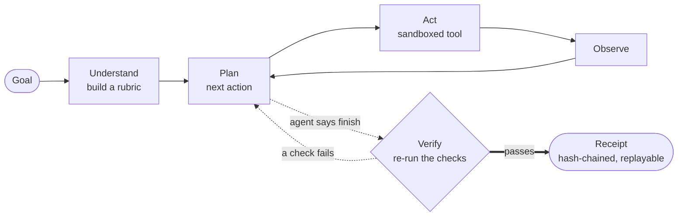
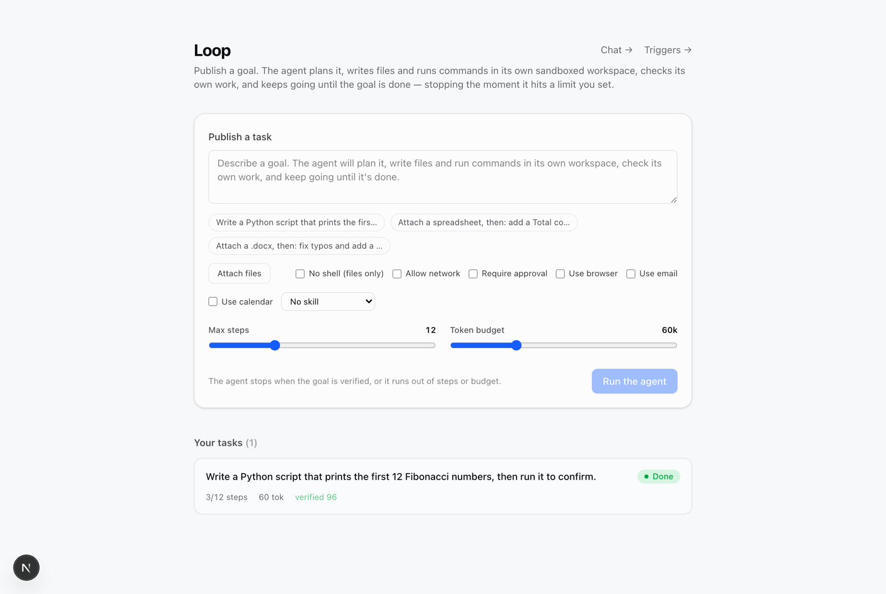

<div align="center">

# Loop

**Give it a goal. It plans the work, runs it in a sandbox, checks its own output by
re-running it, and produces a receipt you can replay — stopping the moment it hits
a limit you set.**

Most personal agents run chat-first on your own machine — handy, but researchers keep
pulling real secrets out of them through prompt injection. Loop is built the other way
around: sandboxed, least-authority, and every task ends in a receipt you can replay.
Runs on a laptop with one LLM API key and no other infrastructure.

[](https://github.com/chriswu727/loop-agent/actions/workflows/ci.yml)
[](./LICENSE)
[](https://www.python.org/)
[](./apps/api/tests)

`Next.js 16` · `FastAPI` · `Python 3.12` · `Postgres or SQLite` · `MIT`

</div>

<p align="center">
  
</p>

<p align="center"><sub>A real finished task. You asked for the first 12 Fibonacci numbers — Loop wrote <code>fib.py</code>, ran it, an independent verifier re-ran the checks on a fresh copy of the workspace, and it shipped a <b>Receipt</b>: <code>verified 96/100</code> · <code>Network: none (default-deny)</code> · <code>hash verified</code>, with the outputs downloadable.</sub></p>

---

## How it works



You give Loop a goal; it runs a **think → act → observe** loop (ReAct):

1. **Understand** — turn the goal into a concrete rubric (success criteria).
2. **Plan** — decide the single next action.
3. **Act** — call a tool: `write_file`, `edit_file`, `read_file`, `run_command`
   (inside a per-task sandboxed workspace), `see_image`, `ask_user`, `spawn`,
   `remember`, or `finish`.
4. **Observe** — feed the result back in, and repeat.
5. **Finish** — an independent **verifier re-runs the machine checks** on a fresh
   copy of the workspace. If the work doesn't hold up, the agent keeps going;
   if it does, Loop writes a tamper-evident **Receipt**.

It stops on the first of: **goal achieved** (verified), **step limit**, **token
budget**, **stuck** (too many failed/blocked actions), or **cancelled** — every
limit clamped to a configured ceiling, so a task can never run away.

## Why Loop — the safe, verifiable alternative

Chat-first personal agents (OpenClaw and its kind) are wildly popular — and, per
independent researchers at **Cisco, Microsoft, Kaspersky and Giskard**, a security
minefield: hundreds of reported vulnerabilities, plaintext credential leaks, and
prompt-injection attacks that have **exfiltrated a real private key from a linked
inbox**. The standing advice is literally "don't run it with your main accounts or
on a machine with sensitive data."

Loop is the agent you _can_ leave running unattended. It does the same class of
real work, but is built so those specific attacks can't succeed — and so "done" is
a fact you can replay, not a claim in a chat log.

|                       | Chat-first agents (OpenClaw-style)                | **Loop**                                                                                |
| --------------------- | ------------------------------------------------- | --------------------------------------------------------------------------------------- |
| **"Done" means**      | a chat reply — no notion of completion            | a **re-executed, hash-chained Receipt** you can replay                                  |
| **Shell / tools**     | main session runs on the **host**                 | production uses a fresh locked-down **Kubernetes Job** per command; egress defaults off |
| **Skills**            | thousands, **unsigned**, injected into the prompt | **ed25519-signed**, capability-scoped, refused if tampered                              |
| **Inbound email/DMs** | injection has exfiltrated real private keys       | quarantined as `[DATA]`; sending/acting needs your approval                             |
| **Secrets**           | plaintext credential leaks reported               | scrubbed from the shell env, masked in tool output, never returned by the API           |
| **Reach**             | 20+ chat channels, huge skill marketplace         | web chat, Telegram, Slack, browser, email, calendar today                               |

Loop concedes raw breadth for now and is closing that gap — but it wins outright on
the two axes a chat-log agent can't retrofit:

- **Verifiable completion.** Every task ships a content-addressed,
  tamper-evident **Receipt** (`receipt.json` + `RECEIPT.md`): the goal, the rubric,
  every machine check the verifier **re-ran on a fresh copy of the workspace**, a
  sha256 of every output file, and the head of a hash-chained step ledger. "Done"
  is a replayable fact — safe to drop into a CI gate (`make verify-receipt`, or
  `scripts/verify_receipt.py` with zero app deps, exits 0/1 and re-hashes the output
  files). Set `AGENT_RECEIPT_SIGNING_KEY` (`make receipt-keygen`) to **ed25519-sign**
  Receipts — then a forger without the key can't recompute a valid one (tamper-_proof_,
  not just evident); verify it offline with `--pubkey`. A run that fell short (a
  limit, a stuck loop, a crash) still ships a Receipt, marked `unverified`, so a
  failure is auditable too.
- **Least authority by construction.** Each task runs under a declared **capability
  envelope** enforced at one choke point: which tools it may use, default-deny
  network egress, and an optional human approval gate for risky commands. Shell
  commands are **jailed in an ephemeral container or Kubernetes Job** (only the
  workspace mounted, network disabled unless granted, can't read the host); the
  command environment is scrubbed so secrets never
  reach a command. **Skills are ed25519-signed** and refused if tampered. Untrusted
  data (tool output, files, memory) is framed so the agent never obeys instructions
  hidden inside it.

| Differentiator                | What it means                                                                                                                   |
| ----------------------------- | ------------------------------------------------------------------------------------------------------------------------------- |
| **Re-execution Receipt**      | the verifier re-runs the agent's checks; a failed check overrides the model's "I'm done"                                        |
| **Tamper-evident ledger**     | each step is hash-chained from a genesis; edit any step and `GET /tasks/{id}/ledger` reports it                                 |
| **Signed skills**             | a skill bundle's ed25519 signature must verify or it won't load — supply-chain safety                                           |
| **Typed capability contract** | `loop.capabilities/v1` separates filesystem, execution, shell network, browser, email, calendar, memory, vision, and delegation |
| **Destination-bound egress**  | network tools require explicit hosts; sandbox traffic can leave only through a token-verifying, DNS-pinning proxy               |
| **Approval gate**             | `require_approval` pauses non-allowlisted commands until you say yes; restart-safe                                              |
| **Injection quarantine**      | tool output, files and memory are `[DATA]`, never commands                                                                      |

## Capabilities

- **Write & run code**, iterating until the checks pass (with self-correction).
- **Edit your documents** — attach an `.xlsx` / `.docx` / `.csv` at publish time and
  the agent edits it in place (openpyxl / python-docx / pandas preinstalled); the
  verifier re-opens the file to prove the edit holds. Outputs are listed and
  **downloadable** from the task view.
- **See images** — with a vision provider (Gemini) configured, the agent can
  `see_image` an uploaded screenshot or photo and act on what it describes.
- **Delegate to sub-agents** — `spawn` hands a self-contained sub-goal to a fresh
  sub-agent that runs its own verified, sandboxed loop and returns a Receipt; a big
  task becomes a _tree_ of independently-verified sub-tasks (depth- and
  budget-bounded).
- **Cross-task memory** — a `remember` tool + transparent Markdown storage scoped
  by authenticated owner and project, so one tenant never receives another's memory.
- **Browse the web** — grant `net.browser` and the agent drives a real
  headless browser through the isolated Provider Gateway (`@playwright/mcp`):
  navigate, read, click, type, extract. Browser authority does not grant shell
  egress, and every destination must be declared before the task starts.
- **Email & calendar** — `use_email` reads the inbox (IMAP, read-only, quarantined)
  and sends (SMTP); `use_calendar` lists and creates events (CalDAV). Anything that
  sends or writes pauses for your approval first.
- **Converse** — group turns into a session (`chat_id`) and follow-ups keep the
  context ("now add tests to it" resolves _it_). A web `/chat` page and a
  channel-agnostic `POST /chat` are the seam any platform plugs into.
- **Chat from Telegram or Slack** — command Loop from chat; it runs the task,
  replies, and asks back when it needs input. Both gate who can use it (an allowlist,
  fail-closed since the bot runs code); Slack is a signature-verified `POST /slack/events`
  webhook, Telegram a poller — both over the same channel-agnostic seam.
- **Triggers** — save a task template and fire it from any external event
  (`POST /hooks/triggers/{id}` with `X-Trigger-Secret`) or on a schedule
  (interval heartbeat).
- **Human-in-the-loop** — `ask_user` pauses for your input and resumes exactly where
  it left off, surviving a process restart. A finished task can be **retried** with
  the same goal and settings (the original stays as an audit record).
- **Live view** — the task page streams updates over SSE (with a polling fallback):
  step timeline, budget meters, output files, and ledger status.

## Try it in 30 seconds (no API key)

Want to see the verified loop before signing up for anything? A built-in demo model
drives one real task end-to-end — writes `fib.py`, runs it, and the verifier
**re-executes its checks** to produce a Receipt — with **no API key**:

```bash
make setup && make demo          # API on :8000, scripted model, DEMO_MODE=1
# then, in another terminal:
pnpm --filter web dev
```

Open http://localhost:3000, publish anything, and watch it plan → write → run →
**verify** → Receipt. Then add a real key (below) to point it at your own goals.

<p align="center">
  
</p>

## Quickstart (zero infrastructure)

No Docker, no Postgres, no Redis. You need **Python 3.12+**, **Node 20+**, and
**pnpm 10** (`corepack enable`), plus one LLM API key.

```bash
# 1) Backend (FastAPI on SQLite, agent runs in-process)
cd apps/api
python -m venv .venv && . .venv/bin/activate
pip install -e ".[dev,office]"        # office extras = xlsx/docx/csv editing
export DEEPSEEK_API_KEY=sk-...         # or ANTHROPIC_API_KEY / GEMINI_API_KEY / GLM_API_KEY
export DATABASE_URL="sqlite+aiosqlite:///./loop.db"
export EXECUTION_MODE=inline CACHE_BACKEND=memory
uvicorn app.main:app --port 8000

# 2) Frontend (another terminal, from the repo ROOT)
corepack enable && pnpm install
pnpm --filter web dev

# 3) (optional, recommended) build the sandbox image so shell commands run
#    jailed in a container instead of on your host — needs Docker running:
docker build -f apps/api/sandbox.Dockerfile -t loop-sandbox:latest .
```

Open http://localhost:3000 and try _"Write a Python script that prints the first 12
Fibonacci numbers, then run it to confirm."_ — watch it write, run, verify, and
produce a Receipt. For the full Docker stack, `cp .env.example .env`, add a key,
run `make authority-keygen`, point `AGENT_AUTHORITY_SIGNING_KEY_FILE` at the private
file and place the public PEM in `AGENT_AUTHORITY_PUBLIC_KEY`, then use `make up`.
Compose builds the sandbox image first; the worker then launches a fresh
locked-down sibling container for every shell command. Networked commands join only
the internal sandbox network and can leave through the destination-enforcing proxy.
Use the Kubernetes production profile for per-command Jobs, tenant-scoped PVC mounts,
immutable image digests, and fail-closed isolation.

## Configuration

See [`.env.example`](./.env.example). Key knobs:

| Variable                                                                    | Purpose                                                                                                                                                    |
| --------------------------------------------------------------------------- | ---------------------------------------------------------------------------------------------------------------------------------------------------------- |
| `ANTHROPIC_API_KEY` / `DEEPSEEK_API_KEY` / `GEMINI_API_KEY` / `GLM_API_KEY` | LLM providers (at least one). A retryable failure is retried, then cascades to the next provider.                                                          |
| `LLM_DEFAULT_PROVIDER`                                                      | which provider to try first.                                                                                                                               |
| `OLLAMA_BASE_URL`                                                           | run on a fully-local model via Ollama (no API key).                                                                                                        |
| `API_TOKEN`                                                                 | optional bearer-token gate on the whole API.                                                                                                               |
| `WEB_AUTH_REQUIRED` / `GITHUB_CLIENT_ID` / `GITHUB_CLIENT_SECRET`           | GitHub OAuth + PKCE login. The web tier mints an HTTP-only, short-lived user JWT; task, trigger, memory, idempotency, and Receipt access are owner-scoped. |
| `LLM_VERIFIER_PROVIDER`                                                     | optional verifier provider, kept separate from the executor model.                                                                                         |
| `TELEGRAM_BOT_TOKEN` / `TELEGRAM_ALLOWED_CHAT_IDS`                          | enable the Telegram inlet + restrict who can use it.                                                                                                       |
| `SLACK_BOT_TOKEN` / `SLACK_SIGNING_SECRET` / `SLACK_ALLOWED_CHANNELS`       | enable the Slack `/slack/events` inlet + its channel allowlist.                                                                                            |
| `SMTP_*` / `IMAP_HOST` / `CALDAV_*`                                         | email send/read + calendar (use a Gmail app password).                                                                                                     |
| `EXECUTION_MODE`                                                            | `inline` (run in the API process) or `worker` (enqueue to Redis).                                                                                          |
| `DATABASE_URL`                                                              | `postgresql+asyncpg://…` or `sqlite+aiosqlite:///./loop.db`.                                                                                               |
| `AGENT_APPROVAL_MODE`                                                       | `auto` or `manual` (pause non-allowlisted commands).                                                                                                       |
| `AGENT_SKILLS_ROOT` / `AGENT_SKILL_TRUST_PUBLIC_KEY`                        | signed-skills folder + the ed25519 key signatures must verify against.                                                                                     |
| `AGENT_RECEIPT_SIGNING_KEY`                                                 | ed25519 key for signed Receipts (`make receipt-keygen`); required in production, optional hash-only mode in development.                                   |
| `AGENT_AUTHORITY_SIGNING_KEY` / `AGENT_AUTHORITY_PUBLIC_KEY`                | worker-only Ed25519 issuer key and gateway/proxy-only verifier key (`make authority-keygen`).                                                              |
| `AGENT_PROVIDER_GATEWAY_URL`                                                | isolated browser/email/calendar/vision service; required for those capabilities in production.                                                             |
| `AGENT_EGRESS_PROXY_URL` / `AGENT_EGRESS_PROXY_AUDIT_URL`                   | authenticated data-plane proxy and worker-only audit endpoint; required in production.                                                                     |
| `AGENT_MEMORY_ROOT`                                                         | cross-task memory store.                                                                                                                                   |
| `AGENT_SANDBOX` / `AGENT_SANDBOX_BACKEND`                                   | `required` fails closed; production selects short-lived Kubernetes Jobs. `preferred` is the explicitly labeled local fallback.                             |
| `AGENT_SANDBOX_IMAGE_DIGEST`                                                | immutable sandbox image digest; required in production and recorded in every isolated Receipt.                                                             |

Per-task safety is set at publish time through the versioned `capabilities` list;
legacy `allowed_tools` / `allow_egress` fields remain migration inputs. A signed
skill can only narrow the requested authority. The UI and Receipt show the resolved
intersection that actually ran. `net.shell` and `net.browser` also require explicit
`egress_hosts`; an empty list never means unrestricted access.
Defaults/caps live in `app/core/config.py`.

## Architecture

A layered (ports-and-adapters) FastAPI backend; the agent lives in the service
layer and talks to the model through a provider registry, to the OS through the
tools, and to the DB through repositories — so the loop runs deterministically under
test with a fake model.

```
apps/api/app/
├── core/llm/          # provider registry (Anthropic/DeepSeek/Gemini/GLM/Ollama) + cascade
├── provider_gateway/  # credential-isolated browser/email/calendar/vision service
├── egress_proxy/      # destination enforcement, DNS pinning, per-run audit
├── tools/             # workspace sandbox, gateway/proxy clients, capability envelope, executor
├── services/
│   ├── agent_react.py # THE ENGINE: understand → plan → act → observe → verify
│   ├── verification.py# re-execution of finish checks on a workspace copy
│   ├── receipt.py     # content-addressed Receipt; ledger.py = hash-chained steps
│   ├── runner.py      # atomic task claim, heartbeat, crash reconciliation
│   ├── skills.py      # signed, capability-scoped skills
│   ├── chat.py        # shared "message → task → reply" seam (Telegram + Slack + /chat)
│   ├── memory.py      # cross-task memory; trigger.py + scheduler.py = triggers/heartbeat
│   └── task.py        # publish / limits / files / approval-resume
└── api/v1/routes/     # tasks (incl. SSE /events), skills, memory, triggers, chat
```

Worker mode uses Redis Streams consumer groups, visibility leases, stale-message
reclaim, bounded retries, and a dead-letter stream. Receipt tooling is available as
`loop receipt inspect|verify|replay|evaluate`; the reusable GitHub Action under
`.github/actions/verify-loop-receipt` provides the offline CI gate.

Design rationale: [`docs/loop.md`](./docs/loop.md). Strategy vs OpenClaw and the
differentiator roadmap: [`docs/STRATEGY.md`](./docs/STRATEGY.md).

## Tests

```bash
cd apps/api && . .venv/bin/activate && pytest    # offline; no provider credentials required
```

Drives every stop condition with a scripted fake model; proves the sandbox refuses
path escapes, the command policy blocks dangerous commands, checks gate acceptance,
the ledger detects tampering (and survives a legitimate human answer), skills reject
bad signatures, egress is default-denied, the shell env is scrubbed of secrets, and
the provider cascade falls over correctly.

## Roadmap

**Delivered:** tool-using agent core, re-execution Receipts, tamper-evident ledger,
capability envelope, default-deny egress, approval gate, injection quarantine, signed
skills, document editing, image understanding, cross-task memory, triggers +
scheduler, SSE live view, provider registry, a **local Ollama provider**, an **MCP
client with a headless browser**, **container isolation**, **multi-agent delegation**
(`spawn` → a tree of verified sub-agents), **email + calendar**, **conversational
sessions** with a web chat page, **Telegram + Slack chat inlets**, and a
**channel-agnostic `/chat` API**, an isolated **Provider Gateway**, short-lived
capability tokens, and **network-layer destination enforcement** with auditable,
DNS-pinned proxy routing.

**Next:** broaden the signed skill catalog and channel ecosystem, persist proxy
audit events outside process memory, split protocol-specific provider egress into
separate network identities where deployments require L4 enforcement, and accumulate
real production/adversarial evidence. Loop's core trust architecture is implemented;
its remaining gap versus mature assistants is ecosystem and operational proof, not
another missing safety layer.

## License

[MIT](./LICENSE).
