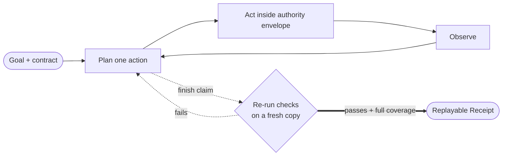

<div align="center">

# Loop

**Hand off a goal and an acceptance contract. Loop works in isolation, re-runs
the evidence, and returns a Receipt anyone can replay.**

[](https://github.com/chriswu727/loop-agent/actions/workflows/ci.yml)
[](https://github.com/chriswu727/loop-agent/actions/workflows/desktop.yml)
[](./LICENSE)
[](https://www.python.org/)

`FastAPI` · `Next.js` · `Electron` · `Postgres/SQLite` · `Redis Streams` · `Kubernetes`

</div>

<p align="center">
  
</p>

## What makes Loop different

Most coding agents end when the model says it is done. Loop separates **work** from
**acceptance**:

1. You confirm concrete success criteria and may provide exact verification commands.
2. Loop works inside a per-task workspace under a server-enforced capability and
   token/step envelope.
3. An independent verifier re-runs the checks on a fresh copy of the workspace.
4. Every criterion must map to passing execution evidence in strict mode.
5. Loop emits a content-addressed Receipt with the contract, checks, model/runtime
   provenance, output hashes, and the head of a hash-chained step ledger.
6. The Receipt can be replayed later through the API, CLI, or bundled GitHub Action.

If the evidence fails, the task does not become `completed` merely because the model
called `finish`. Limit, stuck, cancelled, and error outcomes still receive an
explicitly unverified Receipt for auditability.



## Run the verified demo

Requirements: Node 22.13+, pnpm 11+ (or Corepack), and Python 3.12+. No provider
key, Docker, Postgres, or Redis is required.

```bash
git clone https://github.com/chriswu727/loop-agent.git
cd loop-agent
make demo
```

The command validates the toolchain, installs missing project dependencies, starts
the API and web app with one temporary local token, and opens
<http://localhost:3000>. Choose the Fibonacci example and run it. The deterministic
demo model writes `fib.py`, executes it, satisfies the two user-confirmed criteria,
and produces a Receipt whose checks can be replayed from the task page.

The demo intentionally uses inline execution and the UI labels it **reduced
isolation**. Build the sandbox image or use the Docker/Kubernetes profiles before
running untrusted model-generated commands.

The same browser journey is a required CI check:

```text
fresh environment → open UI → confirm contract → run → execution verified
→ full criterion coverage → replay Receipt → pass
```

The committed [demo smoke report](./evals/results/demo-smoke.json) records `1/1`
solved, zero false acceptances, two steps, 24 scripted tokens, and a passing replay.
It proves product wiring, not general model quality. The separate
[12-case real-provider suite](./evals/verified-completion.json) is published without
invented results; running it requires explicit acknowledgement of provider spend.

## The trust boundary

Loop treats the model as a planner, not an authority source.

- **One tool choke point.** `ToolExecutor.execute` enforces the resolved
  `loop.capabilities/v1` envelope; a skill may narrow it but cannot widen it.
- **Bounded autonomy.** Server-clamped step and token budgets include retries and
  reserve enough budget for verification. Repeated actions, unchanged finish loops,
  and evidence-free exploration stop rather than burn the entire budget.
- **Default-deny egress.** Shell and browser network capabilities are separate and
  require destinations declared before the run. Production traffic is mediated by
  an authority-token-verifying, DNS-pinning proxy.
- **Isolated execution.** The production profile runs commands in short-lived,
  non-root Kubernetes Jobs. Docker is the recommended laptop boundary. Inline mode
  is a visible development fallback, not a sandbox claim.
- **Signed extensions and Receipts.** Skill bundles are verified against an Ed25519
  trust root. Receipts are tamper-evident by default and become origin-authentic when
  signed with a configured private key.
- **Untrusted content stays data.** Prompts label tool output, files, messages, and
  memory as untrusted. The hard guarantee comes from capability, filesystem, egress,
  approval, and secret boundaries—not from claiming prompt injection is impossible.

See [SECURITY.md](./SECURITY.md) for the threat model, guarantees, deployment modes,
and residual risks.

## What is implemented

- ReAct planning with independent executor/verifier provider selection and fallback.
- Strict acceptance contracts, baseline regression checks, criterion-to-evidence
  mappings, Receipt replay, and offline verification.
- Per-task workspaces, container or Kubernetes command isolation, secret redaction,
  destination-bound egress, and restart-safe approval gates.
- Durable Redis Streams workers with visibility leases, stale-message reclaim,
  bounded retries, dead-letter handling, and compare-and-update task claims.
- Transactional local Git project edits through isolated clones and verified
  Apply/Discard/Undo change sets.
- File upload/download and `.xlsx`, `.docx`, `.csv`, image/vision workflows.
- Signed capability-scoped skills, project/owner-scoped memory, and bounded
  Receipt-producing sub-agents.
- Browser, email, calendar, vision, Sibyl research, and Argus QA surfaces behind
  typed capabilities. Host Sibyl/Argus subprocesses are development-only and are
  refused in production.
- Web chat, GitHub OAuth/PKCE, Telegram/Slack inlets, schedules, and webhook triggers.
- Electron packaging on macOS, Windows, and Linux. CI startup-smokes all three;
  public code signing, notarization, and auto-update are not yet configured.

## Local development

```bash
make setup
export DATABASE_URL="sqlite+aiosqlite:///./loop.db"
export EXECUTION_MODE=inline CACHE_BACKEND=memory
export DEEPSEEK_API_KEY=sk-...  # or Anthropic / Gemini / GLM / Ollama
make dev                       # API + web with one temporary local token
```

Build the recommended local command sandbox:

```bash
docker build -f apps/api/sandbox.Dockerfile -t loop-sandbox:latest .
```

Run the production-shaped Compose topology after configuring `.env` and authority
keys:

```bash
cp .env.example .env
make authority-keygen
# point the documented authority variables at the generated private/public keys
make up
```

The Kubernetes acceptance job builds every runtime in a disposable k3d cluster,
migrates the database, runs and re-verifies a queued task in Kubernetes Jobs,
checks NetworkPolicy enforcement, verifies an authentic Receipt, deliberately breaks
the API rollout, and proves rollback.

## Verification

```bash
make check                       # lint + types + offline tests
pnpm --filter web test:e2e       # full zero-key browser journey
make enforcement-acceptance      # Redis restart, worker recovery, revocation
make k8s-deployment-acceptance   # disposable production-mode cluster
```

Current CI also audits locked Python/JavaScript dependencies, builds all runtime
images, validates Compose/Kustomize boundaries, and packages/startup-smokes the
desktop shell on macOS, Windows, and Ubuntu. Backend tests enforce a branch-aware
70% coverage floor; the current full suite reports 72%.

## Repository map

```text
apps/api/          FastAPI control plane, loop, tools, gateways, worker
apps/web/          Next.js product UI and browser acceptance test
apps/desktop/      Electron shell and runtime supervisor
packages/          shared TypeScript contracts and lint/tsconfig
infra/             Docker, desktop Compose, Kubernetes base/overlays
evals/             verified-completion manifests and honest run reports
docs/              ADRs, operational guides, product/system rationale
```

- [Architecture](./ARCHITECTURE.md)
- [Verified Completion evaluation](./evals/README.md)
- [Local development](./docs/guides/local-development.md)
- [Deployment](./docs/guides/deployment.md)
- [Scaling](./docs/guides/scaling.md)
- [Contributing](./CONTRIBUTING.md)
- [Changelog](./CHANGELOG.md)

## Status

`v0.1.0` is a serious portfolio/research release, not a claim of production mileage
or broad adoption. The narrow verified coding path is automated end-to-end; provider
quality still depends on the selected model and should be evaluated with the published
suite before trusting a workload.

MIT licensed.
