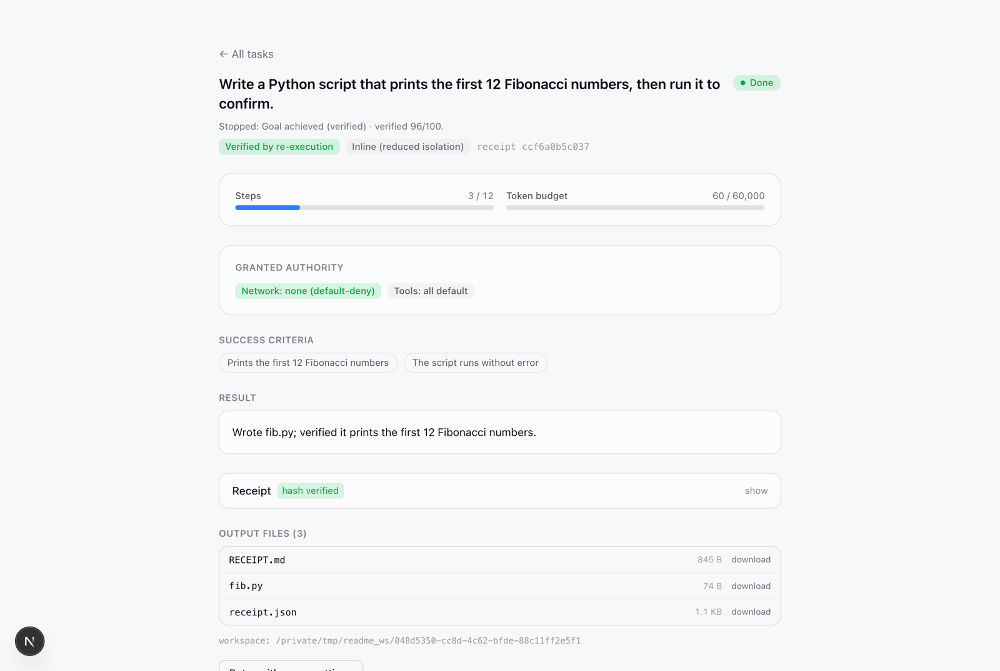
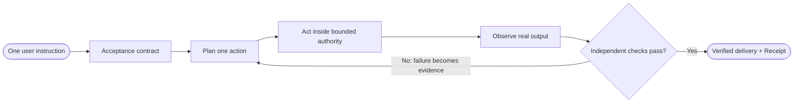

<div align="center">

# Loop

**Give Loop one instruction. It keeps working, testing, and repairing its own
result until it can prove the work is ready to deliver.**

[](https://github.com/chriswu727/loop-agent/actions/workflows/ci.yml)
[](https://github.com/chriswu727/loop-agent/actions/workflows/desktop.yml)
[](./LICENSE)
[](https://www.python.org/)

`FastAPI` · `Next.js` · `Electron` · `Postgres/SQLite` · `Redis Streams` · `Kubernetes`

</div>

<p align="center">
  
</p>

## The core idea

Using an autonomous agent should not mean repeatedly telling it to continue, checking
whether it really ran the tests, or discovering that “done” meant “I wrote some code.”
The user should state the goal once. Loop owns the work between that instruction and a
verified delivery.

Loop turns that idea into a bounded execution protocol:

1. Translate the instruction into a concrete acceptance contract.
2. Plan one useful action, execute it, and observe the real result.
3. Feed failures back into the next decision instead of handing them to the user.
4. Repeat until the required artifacts exist and every acceptance check passes.
5. Re-run the evidence independently on fresh workspace snapshots.
6. Deliver the artifacts with a replayable Receipt—or return an explicit, auditable
   failure when the limits are exhausted.



The loop is autonomous, not unbounded. Capabilities, filesystem scope, egress policy,
approvals, step limits, token budgets, no-progress detection, and a verification reserve
are enforced by the runtime rather than left to the model's discretion.

Loop is designed as the controlled execution layer inside a broader loop-engineering
process: it owns the fast agentic coding loop, gives the developer-feedback loop
versioned evidence, and supports external feedback without pretending to replace human
product judgment. The [product strategy](./docs/STRATEGY.md) records that model and the
ordered v0.2 release gates.

## What makes Loop different

Most agent frameworks help a model call tools. Loop supervises the complete journey from
an instruction to an accepted result. It separates **work** from **acceptance**:

- **The model proposes; the runtime decides.** Tool access and resource limits come from
  a server-enforced authority envelope.
- **A claim is not completion.** Strict tasks complete only when every criterion maps to
  passing execution evidence and every required artifact is present.
- **Failure drives the next loop.** Test output, verifier feedback, and blocked actions are
  preserved as evidence while repeated or evidence-free branches are stopped.
- **Verification is isolated.** Each check runs on its own fresh workspace snapshot, so
  one check cannot manufacture state for another.
- **Delivery is auditable.** The final Receipt records the contract, checks, model and
  runtime provenance, output hashes, and the head of a hash-chained step ledger.
- **Proof is portable.** The Receipt can be replayed later through the API, CLI, or bundled
  GitHub Action.

If the evidence fails, the task does not become `completed` merely because the model
called `finish`. Limit, stuck, cancelled, and error outcomes still receive an
explicitly unverified Receipt for auditability.

## Run the verified demo

Requirements: Node 22.13+, pnpm 11+ (or Corepack), and Python 3.12+. No provider
key, Docker, Postgres, or Redis is required.

```bash
git clone https://github.com/chriswu727/loop-agent.git
cd loop-agent
make demo
```

The command validates the toolchain, installs missing project dependencies, starts
the API and web app with one temporary local token, and opens
<http://localhost:3000>. Choose the Fibonacci example and run it. The deterministic
demo model writes `fib.py`, executes it, satisfies the two user-confirmed criteria,
and produces a Receipt whose checks can be replayed from the task page.

The demo intentionally uses inline execution and the UI labels it **reduced
isolation**. Build the sandbox image or use the Docker/Kubernetes profiles before
running untrusted model-generated commands.

The same browser journey is a required CI check:

```text
fresh environment → open UI → confirm contract → run → execution verified
→ full criterion coverage → replay Receipt → pass
```

The committed [demo smoke report](./evals/results/demo-smoke.json) records `1/1`
solved, zero false acceptances, two steps, 24 scripted tokens, and a passing replay.
It proves product wiring, not general model quality.

A recorded [DeepSeek `deepseek-chat` run](./evals/results/deepseek-chat-v0.1.0.json)
of the [12-case real-provider suite](./evals/verified-completion.json) solved `12/12`
with zero false acceptances: 30 steps, 42,403 provider-reported tokens, and 65.795
seconds. Every case was execution-verified, fully covered, artifact-complete,
integrity-valid, and replayable. This is one clean local run using visibly reduced
`inline` isolation—not a cross-model quality claim or a production-sandbox result.

The separate [one-instruction local-project run](./evals/results/deepseek-chat-one-instruction-v0.1.0.json)
started with only a repository and natural-language goal. It compiled and locked its
own contract, changed the implementation and tests, completed in 5 steps using 8,610
provider-reported tokens and 13.459 seconds, then passed Receipt replay, Apply, and
Undo. This is one clean Gate 1 sample, not a repeated-run reliability estimate.

## The trust boundary

Loop treats the model as a planner, not an authority source.

- **One tool choke point.** `ToolExecutor.execute` enforces the resolved
  `loop.capabilities/v1` envelope; a skill may narrow it but cannot widen it.
- **Bounded autonomy.** Server-clamped step and token budgets include retries and
  reserve enough budget for verification. Repeated actions, unchanged finish loops,
  and evidence-free exploration stop rather than burn the entire budget.
- **Default-deny egress.** Shell and browser network capabilities are separate and
  require destinations declared before the run. Production traffic is mediated by
  an authority-token-verifying, DNS-pinning proxy.
- **Isolated execution.** The production profile runs commands in short-lived,
  non-root Kubernetes Jobs. Docker is the recommended laptop boundary. Inline mode
  is a visible development fallback, not a sandbox claim.
- **Signed extensions and Receipts.** Skill bundles are verified against an Ed25519
  trust root. Receipts are tamper-evident by default and become origin-authentic when
  signed with a configured private key.
- **Untrusted content stays data.** Prompts label tool output, files, messages, and
  memory as untrusted. The hard guarantee comes from capability, filesystem, egress,
  approval, and secret boundaries—not from claiming prompt injection is impossible.

See [SECURITY.md](./SECURITY.md) for the threat model, guarantees, deployment modes,
and residual risks.

## What is implemented

- One-instruction local-repository handoff: bounded read-only discovery, a typed
  compiler plus independent critic, a content-addressed contract locked before the
  first mutation, and an explicit pause when risk, confidence, or authority is not
  safe to infer.
- ReAct planning with independent executor/verifier provider selection and fallback.
- Strict acceptance contracts with required final artifacts, independent check
  snapshots, baseline regression checks, criterion-to-evidence mappings, Receipt
  replay, and offline verification.
- Per-task workspaces, container or Kubernetes command isolation, secret redaction,
  destination-bound egress, and restart-safe approval gates.
- Durable Redis Streams workers with visibility leases, stale-message reclaim,
  bounded retries, dead-letter handling, and compare-and-update task claims.
- Transactional local Git project edits through isolated clones and verified
  Apply/Discard/Undo change sets.
- File upload/download and `.xlsx`, `.docx`, `.csv`, image/vision workflows.
- Signed capability-scoped skills, project/owner-scoped memory, and bounded
  Receipt-producing sub-agents.
- Browser, email, calendar, vision, Sibyl research, and Argus QA surfaces behind
  typed capabilities. Host Sibyl/Argus subprocesses are development-only and are
  refused in production.
- Web chat, GitHub OAuth/PKCE, Telegram/Slack inlets, schedules, and webhook triggers.
- Electron packaging on macOS, Windows, and Linux. CI startup-smokes all three;
  public code signing, notarization, and auto-update are not yet configured.

## Local development

```bash
make setup
export DATABASE_URL="sqlite+aiosqlite:///./loop.db"
export EXECUTION_MODE=inline CACHE_BACKEND=memory
export DEEPSEEK_API_KEY=sk-...  # or Anthropic / Gemini / GLM / Ollama
make dev                       # API + web with one temporary local token
```

Build the recommended local command sandbox:

```bash
docker build -f apps/api/sandbox.Dockerfile -t loop-sandbox:latest .
```

Run the production-shaped Compose topology after configuring `.env` and authority
keys:

```bash
cp .env.example .env
make authority-keygen
# point the documented authority variables at the generated private/public keys
make up
```

The Kubernetes acceptance job builds every runtime in a disposable k3d cluster,
migrates the database, runs and re-verifies a queued task in Kubernetes Jobs,
checks NetworkPolicy enforcement, verifies an authentic Receipt, deliberately breaks
the API rollout, and proves rollback.

## Verification

```bash
make check                       # lint + types + offline tests
pnpm --filter web test:e2e       # full zero-key browser journey
make enforcement-acceptance      # Redis restart, worker recovery, revocation
make k8s-deployment-acceptance   # disposable production-mode cluster
```

Current CI also audits locked Python/JavaScript dependencies, builds all runtime
images, validates Compose/Kustomize boundaries, and packages/startup-smokes the
desktop shell on macOS, Windows, and Ubuntu. Backend tests enforce a branch-aware
70% coverage floor; the current full suite reports 72%.

## Repository map

```text
apps/api/          FastAPI control plane, loop, tools, gateways, worker
apps/web/          Next.js product UI and browser acceptance test
apps/desktop/      Electron shell and runtime supervisor
packages/          shared TypeScript contracts and lint/tsconfig
infra/             Docker, desktop Compose, Kubernetes base/overlays
evals/             verified-completion manifests and honest run reports
docs/              ADRs, operational guides, product/system rationale
```

- [Architecture](./ARCHITECTURE.md)
- [Product strategy and v0.2 gates](./docs/STRATEGY.md)
- [Verified Completion evaluation](./evals/README.md)
- [Local development](./docs/guides/local-development.md)
- [Deployment](./docs/guides/deployment.md)
- [Scaling](./docs/guides/scaling.md)
- [Contributing](./CONTRIBUTING.md)
- [Changelog](./CHANGELOG.md)

## Status

`v0.1.0` is a serious portfolio/research release, not a claim of production mileage
or broad adoption. The narrow verified coding path is automated end-to-end; provider
quality still depends on the selected model and should be evaluated with the published
suite before trusting a workload.

MIT licensed.
